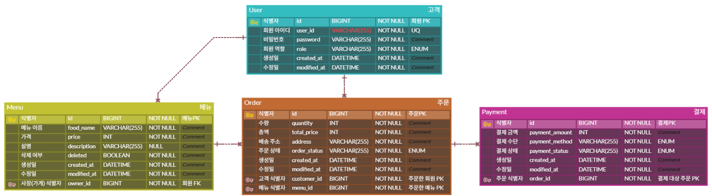

# sparta-onboarding-project
sparta-onboarding-project

# ERD



# API 명세서

## 1. 회원가입

### `POST /api/user/signup`

회원가입을 요청합니다.

**Request Body**
```json
{
  "userId": "test1234",
  "password": "password123",
  "role": "CUSTOMER"
}
```

**Success Response**

- `201 Created`

**Test**
- 아이디 중복 → `403`
- 아이디 3글자 → `400`
- 비밀번호 4글자 → `400`
  
---

## 2. 로그인

### `POST /api/user/login`

아이디와 비밀번호를 확인하고 JWT를 발급합니다.

**Request Body**
```json
{
  "userId": "test1234",
  "password": "password123"
}
```

**Success Response**

- `200 OK`
- `Authorization: Bearer {JWT}`

---

# 3. 메뉴

## 3-1. 메뉴 등록

### `POST /api/menus`

OWNER가 메뉴를 등록합니다.

**Request Body**
```json
{
  "foodName": "치킨",
  "price": 18000,
  "description": "후라이드 치킨"
}
```

**Success Response**

- `201 Created`

---

## 3-2. 메뉴 목록 조회

### `GET /api/menulist`

삭제되지 않은 메뉴 목록을 조회합니다.

**Success Response**

- `200 OK`

---

## 3-3. 메뉴 상세 조회

### `GET /api/menulist/{id}`

특정 메뉴의 상세 정보를 조회합니다.

**Path Variable**

- `id`: 메뉴 ID

**Success Response**

- `200 OK`

---

## 3-4. 메뉴 수정

### `PUT /api/menus/{id}`

OWNER가 본인의 메뉴를 수정합니다.

**Path Variable**

- `id`: 메뉴 ID

**Request Body**
```json
{
  "foodName": "치킨",
  "price": 20000,
  "description": "후라이드 치킨 수정"
}
```

**Success Response**

- `200 OK`

> 현재 구현된 Controller 기준으로 `POST`를 사용합니다.

---

## 3-5. 메뉴 삭제

### `DELETE /api/menus/{id}`

OWNER가 본인의 메뉴를 soft delete합니다.

**Path Variable**

- `id`: 메뉴 ID

**Success Response**

- `204 No Content`

---

# 4. 주문

## 4-1. 주문 생성

### `POST /api/orders`

CUSTOMER가 메뉴를 주문합니다.

**Request Body**
```json
{
  "menuId": 1,
  "quantity": 2,
  "address": "서울시 강남구"
}
```

**Success Response**

- `201 Created`

> 총 주문 금액은 서버에서 `메뉴 가격 × 수량`으로 계산합니다.

---

## 4-2. 주문 목록 조회

### `GET /api/orderlist`

로그인한 사용자의 주문 목록을 조회합니다.

- CUSTOMER: 본인이 주문한 주문 조회
- OWNER: 본인 메뉴에 들어온 주문 조회

**Success Response**

- `200 OK`

---

## 4-3. 주문 취소

### `POST /api/orderlist/{id}/cancel`

CUSTOMER가 본인의 주문을 취소합니다.

**Path Variable**

- `id`: 주문 ID

**Success Response**

- `204 No Content`

> 현재 구현된 Controller 기준으로 `POST`를 사용합니다.

---

## 4-4. 주문 상태 변경

### `POST /api/orderlist/{id}/status`

OWNER가 본인 메뉴에 들어온 주문의 상태를 변경합니다.

허용되는 상태 변경:

```text
PAID → ACCEPTED
ACCEPTED → COMPLETED
```

**Path Variable**

- `id`: 주문 ID

**Request Body**

```json
{
  "status": "ACCEPTED"
}
```

**Success Response**

- `204 No Content`

> 현재 구현된 Controller 기준으로 `POST`를 사용합니다.

---

# 5. 결제

## 5-1. 결제

### `POST /api/payment`

CUSTOMER가 본인의 주문을 결제합니다.

**Request Body**
```json
{
  "orderId": 1,
  "paymentMethod": "CARD"
}
```

**Success Response**

- `201 Created`

> 결제 금액은 요청에서 받지 않고 서버에서 주문의 `totalPrice`를 사용합니다.
> 결제가 성공하면 주문 상태가 `ORDERED`에서 `PAID`로 변경됩니다.

---

# 6. 인증

인증이 필요한 API는 JWT를 요청 헤더에 포함합니다.

```http
Authorization: Bearer {JWT}
```

### 권한

| 기능 | CUSTOMER | OWNER |
|---|:---:|:---:|
| 회원가입 | O | O |
| 로그인 | O | O |
| 메뉴 등록 | X | O |
| 메뉴 조회 | O | O |
| 메뉴 수정 | X | O |
| 메뉴 삭제 | X | O |
| 주문 생성 | O | X |
| 주문 목록 조회 | O | O |
| 주문 취소 | O | X |
| 주문 상태 변경 | X | O |
| 결제 | O | X |
